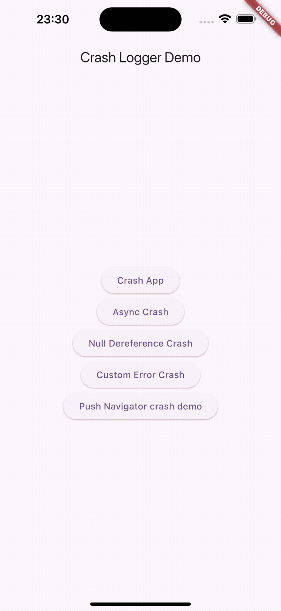

<!--
This README describes the package. If you publish this package to pub.dev,
this README's contents appear on the landing page for your package.

For information about how to write a good package README, see the guide for
[writing package pages](https://dart.dev/tools/pub/writing-package-pages).

For general information about developing packages, see the Dart guide for
[creating packages](https://dart.dev/guides/libraries/create-packages)
and the Flutter guide for
[developing packages and plugins](https://flutter.dev/to/develop-packages).
-->

# Flutter Debug Helper



A powerful Flutter package that helps you debug your app by providing a beautiful error overlay and comprehensive error tracking capabilities.

[](https://pub.dev/packages/flutter_debug_helper)

## Features

- 🎯 Beautiful error overlay with stack trace visualization
- 🔍 Filter stack traces to focus on your app's code
- 🚀 Support for both sync and async errors
- 🛠️ Development mode support with `onlyDev` flag
- 📱 Responsive design that works on all screen sizes
- 📝 Error logging callback support

## Installation

Add this to your package's `pubspec.yaml` file:

```yaml
dependencies:
  flutter_debug_helper: ^1.0.0
```

**Important:** You must also add your `pubspec.yaml` file to your Flutter assets so the package can read your package name for stack trace filtering. Add this to your `pubspec.yaml`:

```yaml
flutter:
  assets:
    - pubspec.yaml
```

## Usage

1. Wrap your app with `FlutterDebugHelper.install()`:

```dart
void main() {
  FlutterDebugHelper.install(MyApp());
}
```

2. Add the `StackTraceOverlay` widget to your app:

```dart
class MyApp extends StatelessWidget {
  @override
  Widget build(BuildContext context) {
    return MaterialApp(
      home: StackTraceOverlay(
        onlyDev: true, // Only show overlay in development mode
        onLogs: (logs) {
          // Optional: Handle error logs
          print(logs);
        },
        child: YourApp(),
      ),
    );
  }
}
```

## Features in Detail

### Error Overlay

When an error occurs, a beautiful overlay appears with:

- Error message and type
- Stack trace with syntax highlighting
- Filtering options to focus on your app's code
- Easy dismissal with tap or close button

### Development Mode

Use the `onlyDev` flag to control when the overlay appears:

```dart
StackTraceOverlay(
  onlyDev: true, // Overlay only appears in development mode
  child: YourApp(),
)
```

### Error Logging

Capture error logs for further processing:

```dart
StackTraceOverlay(
  onLogs: (logs) {
    // Process error logs
    // logs is a List<String> containing stack trace lines
  },
  child: YourApp(),
)
```

## Example

Check out the [example](example) directory for a complete demo app showcasing various error scenarios:

- Synchronous errors
- Asynchronous errors
- Navigation errors
- Custom errors

## Contributing

Contributions are welcome! Please feel free to submit a Pull Request.

## License

This project is licensed under the MIT License - see the [LICENSE](LICENSE) file for details.
